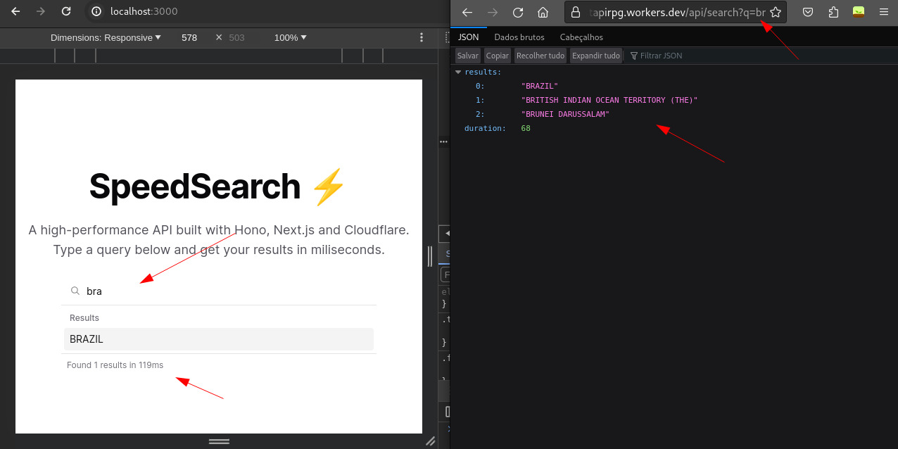
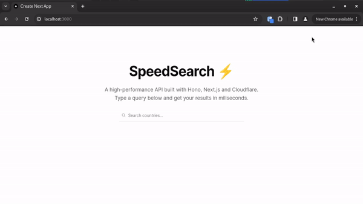

<h1 align="center">⚡ Front + API de alta Performance (NextJS, Hono, Redis, Cloudflare Workers, typescript, ShadcnUI)</h1>

<p align="center">
  

  

  
  
  <a href="https://github.com/williamjayjay/Github-Blog/commits/master">
    
  </a>
    
   <a href="https://github.com/williamjayjay/front-api-nextjs-veryfastSearch/stargazers">
    
  </a>
</p>

<p align="center">Vamos construir juntos uma API bem rápida. Fazendo isso, você aprenderá como usar o Hono, uma estrutura web leve, Cloudflare Workers para código em servidor distribuído globalmente e Redis como um banco de dados rápido.<br/><strong>Está é apenas uma POC de API veloz com NextJS</strong>.</p>

<p align="center">

</p>

## 🥶 Sobre o projeto

Desenvolvi esse projeto, baseado em estudos sobre o funcionamento da API Router com NextJS, aplicando também agumas tecnologias para deixar a busca mais rápida e destribuida globalmente assim diminuindo de fato a lentidão na busca dos países em um front-end simples com tailwind e shadcn-ui. 

## Página Web:

**Web:** O front desenvolvido com NextJS, utiliza estilos com tailwind e os componentes com a biblioteca shadcn-ui.


## 🚀 Tecnologias

Principais tecnologias que utilizei para desenvolver esta aplicação web

- [TailwindCSS](https://tailwindcss.com/)
- [Shadcn-UI](https://ui.shadcn.com/docs/installation/next)
- [Hono](https://github.com/honojs/hono)
- [Upstash-Redis](https://console.upstash.com/redis)
- [Cloudflare](https://dash.cloudflare.com)


## Guia de inicialização

Para instalar e configurar uma cópia local, siga estas etapas simples:

### Prerequisitos

Para garantir o funcionamento adequado da nossa aplicação, verifique abaixo:

1. **Clone o repositório**:
   ```sh
   git clone https://github.com/williamjayjay/front-api-nextjs-veryfastSearch
   ```
2. **Cadastrar no upstash-redis:** Crie o banco REDIS através deste [link aqui](https://console.upstash.com/redis)

3. **Colar credenciais upstash:** Cole no arquivo .env e wrangler.toml as credenciais da URL e do TOKEN.

4. **Rodar as SEEDS:** Rode a seed que contém o nome dos países, para salvar isso no nosso banco Redis.
   ```sh
   yarn tsx src/lib/seed.ts
   ``` 

5. **Instale os módulos com PNPM ou YARN:**
  ```sh
  # Instale usando yarn
  yarn i
  
  # Instale usando pnpm
  pnpm i
  ```

6. **Fazer deploy para cloudfare:** Suba a API em NEXTJS para a Cloudfare.
```sh
yarn deploy
``` 

7. **Rodar a aplicação com PNPM ou YARN:**
  ```sh
  # Instale usando yarn
  yarn dev
  
  # Instale usando pnpm
  pnpm dev
  ```

## Roadmap

- [x] Fazer busca muito rápida por nomes de países salvos no banco REDIS online.
    - [x] Exibir os milisegundos da busca

- [x] Após o deploy na cloudfare, é possivel acessar a sua api, similar a route props a seguir: "suaurl.workers.dev/api/search?q=br"

## WEB UX
Desenvolvi a tela principal de forma simples para dar ênfase apenas na estrutura da busca veloz.


<p align="center">
  
</p>